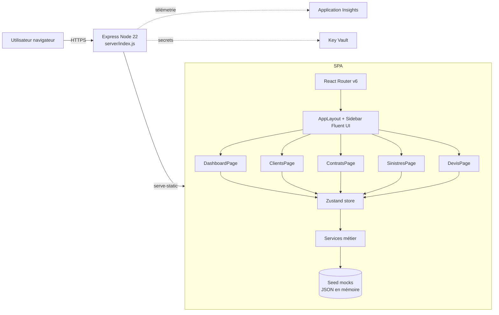

# ARCHITECTURE.md — Baraka Assurance

> Agent 1 — **Architect Agent** (PLAN)
> Produit : plan technique validé par le lead avant implémentation.

---

## 1. Contexte

Application web interne pour **Baraka Assurance** permettant de gérer le cycle de vie
des **sinistres automobile** et des produits d'assurance associés : clients, contrats,
devis. Démonstration GitHub Copilot + Loop Engineering, déploiement Azure.

**Hypothèses de la démo**
- Données 100 % mockées (JSON en mémoire + stockage `localStorage` pour la persistance CRUD).
- Pas d'authentification réelle — un sélecteur de rôle (Assuré / Gestionnaire / Expert / Admin) suffit à montrer les habilitations.
- 5 écrans publics + layout commun.

---

## 2. Stack

| Couche | Choix | Justification |
|---|---|---|
| Build | **Vite 5** + React 18 + TypeScript strict | Démarrage rapide, HMR, TS natif |
| UI | **Fluent UI v9** (@fluentui/react-components) | Design system Microsoft, aligné Azure |
| Routing | **React Router v6** | Routes nested, outlet pour layout |
| State | **Zustand** | Store léger, pas de boilerplate |
| Tests | **Vitest** + React Testing Library + jsdom | Rapide, API compatible Jest |
| Lint | ESLint + Prettier | Qualité statique |
| Serveur prod | **Express** (serve-static) | Imposé par la cible Azure Web App Node 22 |
| CI/CD | GitHub Actions | Build + test + deploy |
| Cloud | Azure Web App Linux (B1) + Application Insights + Key Vault | Cible démo |

---

## 3. Arborescence cible

```
baraka-assurance-app/
├── .github/
│   └── workflows/
│       └── azure-webapp.yml
├── scripts/
│   └── azure-provision.ps1
├── public/
│   └── favicon.svg
├── server/
│   └── index.js                 # Express pour servir le SPA en prod
├── src/
│   ├── main.tsx
│   ├── App.tsx
│   ├── index.css
│   ├── vite-env.d.ts
│   ├── models/
│   │   ├── types.ts             # Interfaces + enums
│   │   └── index.ts
│   ├── mocks/
│   │   └── seed.ts              # 10 clients, 20 contrats, 8 sinistres, 5 devis
│   ├── services/
│   │   ├── clientService.ts
│   │   ├── contratService.ts
│   │   ├── sinistreService.ts
│   │   ├── devisService.ts
│   │   └── dashboardService.ts
│   ├── store/
│   │   └── useAppStore.ts       # Zustand
│   ├── layout/
│   │   ├── AppLayout.tsx        # Shell Fluent UI + sidebar
│   │   └── Sidebar.tsx
│   ├── components/
│   │   ├── KpiCard.tsx
│   │   ├── StatusBadge.tsx
│   │   └── EmptyState.tsx
│   └── pages/
│       ├── DashboardPage.tsx
│       ├── ClientsPage.tsx
│       ├── ContratsPage.tsx
│       ├── SinistresPage.tsx
│       └── DevisPage.tsx
├── tests/
│   ├── setup.ts
│   ├── services/
│   │   ├── clientService.test.ts
│   │   ├── contratService.test.ts
│   │   ├── sinistreService.test.ts
│   │   ├── devisService.test.ts
│   │   └── dashboardService.test.ts
│   └── components/
│       ├── DashboardPage.test.tsx
│       ├── SinistresPage.test.tsx
│       └── AppLayout.test.tsx
├── index.html
├── package.json
├── tsconfig.json
├── tsconfig.node.json
├── vite.config.ts
├── .eslintrc.cjs
├── .prettierrc
├── .gitignore
└── README.md
```

---

## 4. Modèle de données TypeScript

```ts
// Enums métier
export enum TypeContrat {
  Auto = 'Auto',
  Habitation = 'Habitation',
  Sante = 'Santé',
  Vie = 'Vie',
}

export enum StatutContrat {
  Actif = 'Actif',
  Suspendu = 'Suspendu',
  Resilie = 'Résilié',
}

export enum StatutSinistre {
  Ouvert = 'Ouvert',
  EnCours = 'En cours',
  Clos = 'Clos',
}

export enum StatutDevis {
  Brouillon = 'Brouillon',
  Envoye = 'Envoyé',
  Accepte = 'Accepté',
  Refuse = 'Refusé',
}

export interface Client {
  id: string;
  nom: string;
  prenom: string;
  email: string;
  telephone: string;
  ville: string;
  dateNaissance: string; // ISO
  dateCreation: string;  // ISO
}

export interface Contrat {
  id: string;
  numero: string;          // ex: CT-2026-00042
  clientId: string;
  type: TypeContrat;
  dateDebut: string;
  dateFin: string;
  primeAnnuelle: number;   // en MAD
  statut: StatutContrat;
}

export interface Sinistre {
  id: string;
  numero: string;          // ex: SN-2026-00007
  contratId: string;
  dateDeclaration: string;
  dateIncident: string;
  description: string;
  montantEstime: number;
  statut: StatutSinistre;
}

export interface Devis {
  id: string;
  numero: string;          // ex: DV-2026-00005
  clientId: string;
  type: TypeContrat;
  dateCreation: string;
  montantPropose: number;
  statut: StatutDevis;
}

export interface DashboardKpi {
  nbClients: number;
  nbContratsActifs: number;
  nbSinistresOuverts: number;
  primeTotale: number;
  repartitionContratsParType: Record<TypeContrat, number>;
  sinistresParStatut: Record<StatutSinistre, number>;
}
```

---

## 5. Diagramme d'architecture



---

## 6. User stories priorisées

| ID | Rôle | Besoin | Priorité | Critères d'acceptation |
|---|---|---|---|---|
| US01 | Gestionnaire | Voir d'un coup d'œil l'activité (KPI) | P0 | Dashboard affiche 4 KPI + répartition contrats par type + sinistres par statut |
| US02 | Gestionnaire | Lister / rechercher les clients | P0 | Table paginée + filtre texte sur nom/email/ville |
| US03 | Gestionnaire | Visualiser les contrats avec filtre par type et statut | P0 | DataGrid filtrable, badge couleur par statut |
| US04 | Gestionnaire | Gérer un sinistre (CRUD + changement de statut) | P0 | Création via dialog, édition inline, suppression confirmée |
| US05 | Assuré | Saisir un devis rapide | P0 | Formulaire validé (client, type, montant), ajout dans la liste |
| US06 | Tous | Navigation claire via sidebar | P0 | Sidebar persistante, item actif mis en évidence, accessible clavier |
| US07 | Tous | États vides et chargements lisibles | P1 | Composant EmptyState sur chaque liste vide |

---

## 7. Volumétrie seed démo

- **10 clients** aux noms maghrébins (Benali, El Amrani, Chraïbi, Tazi, Bennani…).
- **20 contrats** répartis Auto/Habitation/Santé/Vie, statuts majoritairement Actif.
- **8 sinistres** liés aux contrats Auto principalement, statuts variés.
- **5 devis** avec statuts Brouillon/Envoyé/Accepté/Refusé.

---

## 8. Critères de sortie Phase 1

- [x] `ARCHITECTURE.md` versionné.
- [x] Modèle TS complet et typé strict.
- [x] Arborescence validée.
- [x] Diagramme Mermaid.
- [x] User stories priorisées avec critères d'acceptation.

**→ Handoff au Code Builder.**
