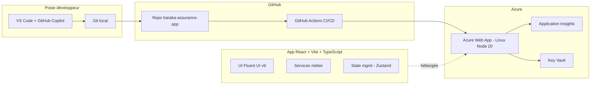
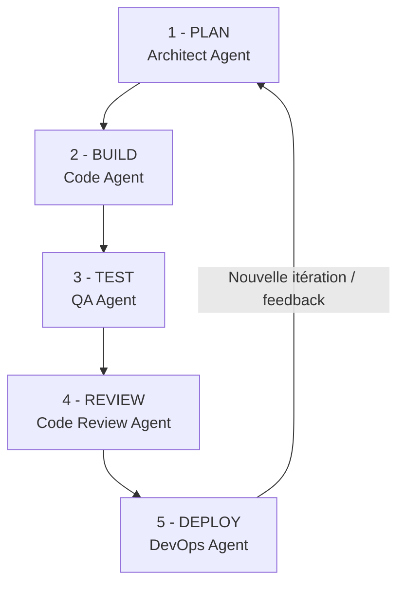

# Démo Baraka Assurance — Code App & Loop Engineering avec GitHub Copilot

**Client :** Baraka Assurance
**Objectif :** Démontrer la construction d'une **application web moderne** (React + Vite + TypeScript) assistée par **GitHub Copilot**, en appliquant un **cycle complet d'ingénierie (Loop Engineering)** piloté par des agents IA spécialisés, puis **déploiement sur Azure Web App**.
**Durée :** 45–60 min

---

## 1. Vision

> *Construire devant le client, de A à Z, une application web pour Baraka Assurance : React + TypeScript, testée, revue et déployée en production sur Azure — le tout en moins d'une heure, avec GitHub Copilot comme co-pilote et un cycle d'ingénierie piloté par des agents IA spécialisés.*

**Messages clés :**
- Application **100 % code** (React / Vite / TS) → versionnée, portable, scalable.
- **Loop Engineering** : chaque étape (plan → code → test → review → deploy) a son **agent dédié**.
- **Déploiement cloud-native** sur Azure Web App avec CI/CD GitHub Actions.
- **Traçabilité, auditabilité, reproductibilité** : rien de magique.

---

## 2. Architecture Cible

### Stack Technique

| Couche | Technologie |
|---|---|
| Frontend | React 18, TypeScript, Vite |
| UI | Fluent UI v9 |
| Routing | React Router v6 |
| State | Zustand |
| Tests | Vitest + React Testing Library |
| Lint | ESLint + Prettier |
| CI/CD | GitHub Actions |
| Hébergement | Azure Web App (Linux, Node 20) |
| Observabilité | Azure Application Insights |
| Secrets | Azure Key Vault |

### Fonctionnalités métier (périmètre démo)

- **Dashboard** : KPI (nb clients, contrats actifs, sinistres ouverts, prime totale)
- **Clients** : liste et fiche détail
- **Contrats** : Auto, Habitation, Santé, Vie — avec filtres
- **Sinistres** : CRUD complet avec gestion des statuts (Ouvert / En cours / Clos)
- **Devis** : formulaire de création rapide

> Les données sont **mockées** (JSON local) — zéro dépendance externe pendant la démo.

---

## 3. Loop Engineering — Les 5 phases

Chaque phase est pilotée par un **agent spécialisé**, produit un **livrable précis** et dispose d'un **critère de sortie clair**.

---

## 4. Les Agents du Loop

### 🧭 Agent 1 — Architect Agent (PLAN)

**Rôle**
Analyser le besoin métier, concevoir l'architecture logicielle, le modèle de données et la structure applicative.

**Responsabilités**
- Lire et interpréter le cahier des charges
- Proposer une arborescence projet claire
- Définir les modèles TypeScript (interfaces, enums, types)
- Lister les écrans et user stories prioritaires
- Produire un diagramme d'architecture

**Entrées**
- Besoin métier Baraka Assurance
- Contraintes techniques (stack imposée)

**Livrables**
- Fichier `ARCHITECTURE.md`
- Diagramme Mermaid de l'application
- Liste priorisée des user stories
- Modèle de données TypeScript

**Critère de sortie**
Le plan est validé par le lead technique / le client.

---

### 🏗️ Agent 2 — Code Builder (BUILD)

**Rôle**
Transformer le plan en code fonctionnel. Scaffolder, implémenter composants, services, routing, UI.

**Responsabilités**
- Scaffolding Vite + React + TypeScript
- Installation des dépendances (Fluent UI, React Router, Zustand, Vitest)
- Création des modèles, services, store, layout
- Implémentation des écrans (Dashboard, Clients, Contrats, Sinistres, Devis)
- Génération des données mock cohérentes

**Entrées**
- Plan de l'Architect Agent
- Modèles de données validés

**Livrables**
- Projet complet lancable par `npm run dev`
- Écrans fonctionnels avec données mockées
- Code TypeScript strict, 0 warning

**Critère de sortie**
L'application tourne en local sur `http://localhost:5173` avec les 5 écrans navigables.

---

### 🧪 Agent 3 — QA Agent (TEST)

**Rôle**
Garantir la qualité et la non-régression via des tests automatisés.

**Responsabilités**
- Configuration de Vitest (environnement jsdom, setup, scripts)
- Tests unitaires des services métier
- Tests de composants React (RTL)
- Mesure et amélioration de la couverture
- Correction des bugs révélés par les tests

**Entrées**
- Code produit par le Code Builder
- Critères de qualité (couverture minimale)

**Livrables**
- Suites de tests `*.test.tsx` et `*.test.ts`
- Rapport de couverture ≥ 60 % (100 % sur les services)
- Scénarios de test documentés

**Critère de sortie**
`npm test` → 0 test rouge ; `npm run test:coverage` → seuils respectés.

---

### 👀 Agent 4 — Code Review Agent (REVIEW)

**Rôle**
Relire le code avec un œil senior, détecter bugs, failles, anti-patterns, dette technique.

**Responsabilités**
- Analyse de la Pull Request complète
- Détection de bugs, problèmes de typage, accessibilité, performance
- Analyse de sécurité (XSS, injections, secrets)
- Priorisation des findings (Critical / High / Medium / Low)
- Proposition et application des corrections

**Entrées**
- Diff de la Pull Request
- Grille de review (critères qualité)

**Livrables**
- Rapport de review en markdown
- Commentaires inline sur la PR
- Correctifs committés pour les findings Critical et High

**Critère de sortie**
PR approuvée, 0 vulnérabilité High ou Critical restante.

---

### 🚀 Agent 5 — DevOps Agent (DEPLOY)

**Rôle**
Automatiser le déploiement de l'application en production sur Azure.

**Responsabilités**
- Provisionnement des ressources Azure via `az` CLI (Resource Group, App Service Plan, Web App, Application Insights, Key Vault)
- Configuration du runtime Node 20 + serveur Express pour servir le SPA
- Création du workflow GitHub Actions (build + test + deploy)
- Configuration du Service Principal et des secrets GitHub
- Validation post-déploiement (logs, Application Insights, URL publique)

**Entrées**
- Branche `main` à jour et PR approuvée
- Souscription Azure avec droits Contributor

**Livrables**
- Script `scripts/azure-provision.ps1` idempotent
- `.github/workflows/azure-webapp.yml`
- Ressources Azure provisionnées
- URL publique : `https://baraka-assurance-app.azurewebsites.net`
- Télémetrie active dans Application Insights

**Critère de sortie**
Application accessible publiquement, HTTP 200 sur la home, premières requêtes visibles dans Application Insights.

---

## 5. Synthèse — Vue d'ensemble des agents

| # | Agent | Phase | Livrable principal | Durée démo |
|---|---|---|---|---|
| 1 | 🧭 Architect | PLAN | `ARCHITECTURE.md` + diagramme | 5 min |
| 2 | 🏗️ Code Builder | BUILD | App fonctionnelle locale | 15 min |
| 3 | 🧪 QA | TEST | Suite de tests verte, coverage | 5 min |
| 4 | 👀 Code Reviewer | REVIEW | Rapport + PR approuvée | 5 min |
| 5 | 🚀 DevOps | DEPLOY | URL Azure en production | 10 min |

---

## 6. Points Forts à Mettre en Avant

1. ⚡ **Vitesse** — application complète déployée en moins de 60 minutes.
2. 🧠 **Qualité** — chaque étape passée par un agent spécialisé, pas de "vibe coding".
3. 🔍 **Traçabilité** — tout dans Git, PR revue, logs Azure, Application Insights.
4. 🔄 **Agilité** — le LOOP intègre un feedback client en quelques minutes.
5. 🔐 **Sécurité** — secrets dans Key Vault, Service Principal, zéro credential en dur.
6. 📈 **Observabilité native** — Application Insights dès J1.
7. 🏗️ **Portabilité** — code 100 % standard → tourne sur Azure, AWS, GCP, on-prem.

---

## 7. Pré-requis Techniques (jour J)

### Poste de démo
- VS Code + extension GitHub Copilot (connecté)
- GitHub Copilot CLI installé
- Node.js 20 LTS
- Git, GitHub CLI (`gh`), connectés
- Azure CLI (`az`), connecté
- PowerShell 7+

### Compte Azure
- Souscription active avec droits Contributor
- Région cible : `francecentral` ou `westeurope`
- Quota B1 App Service Plan disponible

### Compte GitHub
- Droits de création de repo
- Nom du repo cible : `baraka-assurance-app`

### Confidentialité
- Toutes les données de démo sont **fictives**
- Aucun secret en dur dans le code (tout via Key Vault + GitHub Secrets)

---

## 8. Suite — Prochaines Étapes Commerciales

- 📋 **Atelier de cadrage** — affiner le métier Baraka (tarification, workflows de validation, intégration SI).
- 🚀 **POC 2 à 4 semaines** — application réelle sur un périmètre priorisé (ex : gestion des sinistres auto).
- ⚙️ **Mise en place DevOps complète** — environnements Dev / Recette / Prod, pipelines, monitoring.
- 🎓 **Formation équipe interne** — React/TS, GitHub Copilot, Azure Web Apps.
- 🤝 **Contrat de TMA** — maintenance évolutive et support.

---

**Préparé pour la démo Baraka Assurance — Fedi Ben Ammar**
